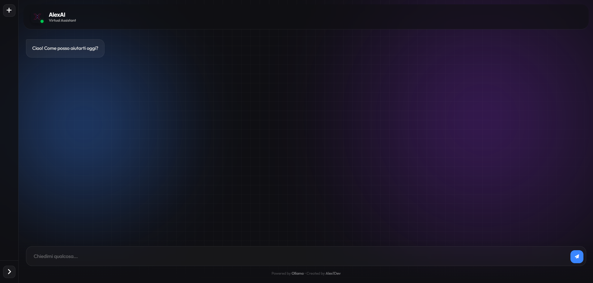

# XenoAI - Chat Interface

A modern, responsive, and lightweight chat interface built with PHP, SQLite, and vanilla JavaScript, designed to interact with local LLMs (Large Language Models) via Ollama.



## 🚀 Features

- **Local AI Integration**: Seamlessly connects to Ollama (default model: `qwen2.5:1.5b-instruct-q4_K_M`) for privacy-focused AI interactions.
- **Modern UI/UX**: 
  - Glassmorphism design with dynamic background effects.
  - Fully responsive layout (mobile-first approach).
  - Smooth typing indicators and real-time streaming responses.
  - Markdown support with code highlighting.
- **Chat Management**:
  - Create multiple conversations.
  - Sidebar history with auto-generated titles.
  - Rename and delete chat capabilities.
  - **Auto-Cleanup**: Automatically deletes conversations older than 30 days to maintain performance.
- **Data Persistence**:
  - Uses SQLite for robust, server-less data storage.
  - Automatic database creation and initialization on first run.
  - Cascading deletes for efficient data management.
- **Performance**:
  - No heavy frameworks (Vanilla JS, PHP).
  - Efficient asset caching (cache-busting strategy).
  - Streamed responses for instant feedback.

## 📂 Project Structure

```
/
├── api/
│   ├── api.php           # Handles AI model communication (SSE streaming)
│   ├── chat_manager.php  # CRUD operations for conversations
│   ├── db.php            # Database connection and schema management
│   ├── proxy.php         # Central routing for API requests
│   └── reset.php         # Session reset functionality
├── assets/
│   ├── style.css         # Main stylesheet (CSS Variables, Flexbox/Grid)
│   ├── script.js         # Frontend logic (DOM manipulation, Fetch API)
│   └── ...               # Images and icons
├── config.php            # Configuration settings (Model params, System prompt)
├── functions.php         # Helper functions (e.g., asset versioning)
├── index.php             # Main application entry point
└── chat_history.db       # SQLite database (auto-created)
```

## 🛠️ Setup & Installation

1.  **Prerequisites**:
    - PHP 8.1 or higher with `sqlite3` and `pdo_sqlite` extensions enabled.
    - A web server (Apache/Nginx).
    - [Ollama](https://ollama.com/) running locally (default port: `11434`).

2.  **Clone the Repository**:
    ```bash
    git clone https://github.com/alex1dev0/xenoai.git
    cd xenoai
    ```

3.  **Configure Ollama**:
    Ensure your Ollama instance is running and has the required model installed:
    ```bash
    ollama pull qwen2.5:1.5b-instruct-q4_K_M
    ```
    *Note: You can change the model in `config.php`.*

4.  **Run**:
    Serve the project using your preferred web server or PHP's built-in server:
    ```bash
    php -S localhost:8000
    ```
    Access `http://localhost:8000` in your browser.

## ⚙️ Configuration & Customization

### Changing the AI Model
Open `config.php` and modify the `model` array:
```php
'model' => [
    'name' => 'llama3', // Change to your preferred model
    'api_endpoint' => 'http://127.0.0.1:11434/api/chat',
    'max_tokens' => 1024,
    ...
],
```

### Modifying the System Prompt
Customize the AI's persona in `config.php` under `'session' => 'system_message'`.

### Database Management
The application uses a local SQLite database (`chat_history.db`).
- **Location**: Root directory (created automatically).
- **Auto-Cleanup**: By default, chats older than 30 days are deleted. You can modify this retention period in `api/db.php` inside the `cleanupOldConversations()` method.

## 🤝 Contributing

Contributions are welcome! Please feel free to submit a Pull Request.

1.  Fork the project
2.  Create your feature branch (`git checkout -b feature/AmazingFeature`)
3.  Commit your changes (`git commit -m 'Add some AmazingFeature'`)
4.  Push to the branch (`git push origin feature/AmazingFeature`)
5.  Open a Pull Request

## 📜 License

Distributed under the MIT License. See `LICENSE` for more information.

---

Created by **Alex1Dev**
